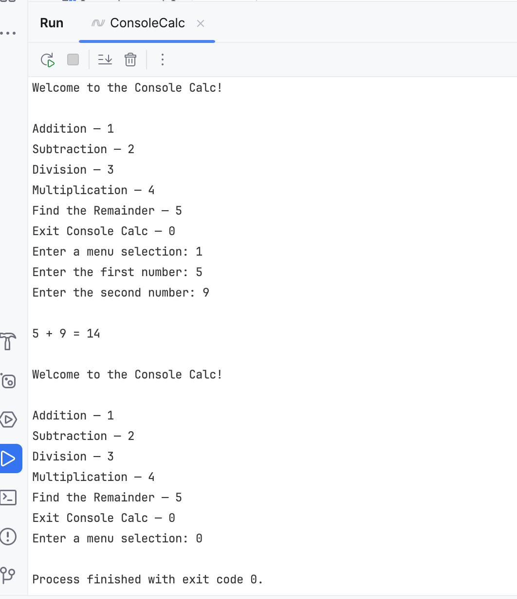

# ConsoleCalc
## Project Overview
ConsoleCalc is a simple, lightweight C# console application that allows the end 
user to perform very basic math calculations. I am using this project to update 
and build on my C# programming skills.

The following technologies were used with this project:
* Rider
* Git
* C#
## Development
This project started as a simple console application to give me an
MVP for this calculator app. It also serves as a practice project for the C#
programming language before I dive into updating my OOP knowledge.
## Solution Design
The design for this application is currently not very elegant and lacks many 
features it needs to be deemed useful to an end user. However, as I continue to
refresh my C# programming skills, I will smooth out its rough edges to make it 
more presentable.
## Upcoming Plans
* Redesign logic to make solution more concise
* Add error handling
* Add more complicated mathematical operations and logic
* Transition it into a multi-platform software application
## Current Design
